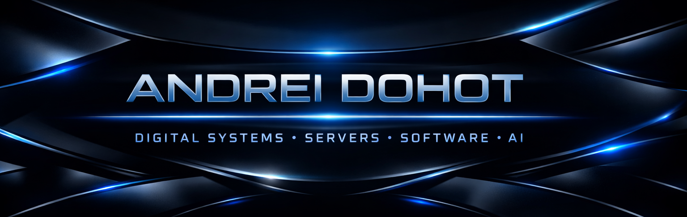

  

<h1 align="center">
  👋 Hello, I'm Andrei Dohot
</h1>

  

---

  
  
  
  

---

# 🚀 Identity

I engineer **scalable digital ecosystems** across software, infrastructure, automation, AI-assisted workflows, and visual precision.

⚡ High-Performance Systems  
🌐 Infrastructure & Servers  
🧠 AI-Enhanced Automation  
🎨 Visual & UX Sensitivity  
🚀 Scalable Architectures  

---

# ⚙️ Core Domains

## 🧩 Software Engineering
- SaaS Platforms  
- Web Applications  
- Mobile Applications  
- REST APIs  
- Backend Architectures  
- System Design  
- Clean Code & Scalability  

---

## 🌐 Infrastructure & DevOps
- Linux Systems  
- Docker & Containers  
- Networking Fundamentals  
- CI/CD Pipelines  
- Deployment Automation  
- Performance Optimization  
- Server Architecture  

---

## 🎮 Game / Server Ecosystems
- Minecraft Server Systems  
- Server Optimization  
- Plugin Logic / Systems  
- Multiplayer Infrastructure  

---

## 🤖 AI & Automation
- AI-Enhanced Workflows  
- Automation Pipelines  
- Smart Integrations  

---

## 🤝 Bots & Integrations
- Discord Bot Development  
- Automation Bots  
- API Integrations  

---

## 🎨 Creative & Visual
- Photography  
- UI / UX Precision  
- Branding & Aesthetics  

---

## 🚗 Automotive & Detailing
- Workflow Optimization  
- Precision-Driven Craft  

---

# 🧠 Skill Matrix

### 💻 Development

---

### 🌐 Infrastructure

---

### 🤖 Automation / AI

---

### 🤝 Bots

---

# 🧩 Technology Stack

## 🎨 Frontend / UI

---

## ⚙️ Backend / Logic

---

## 🗄️ Databases

---

## 🖥 Systems / DevOps

---

## 🤖 Bots / Integrations

---

# 📊 GitHub Analytics

  

---

# 🏆 Achievements

  

---

# 📈 Activity Graph

  

---

# 🎯 Motto

  
  
  
  
  

---

# ✨ Philosophy

Exceptional digital systems emerge where:

⚡ Engineering Discipline  
🎨 Visual Precision  
🧠 System Thinking  
🚀 Scalability  

work together as a unified strategy.

---

  

