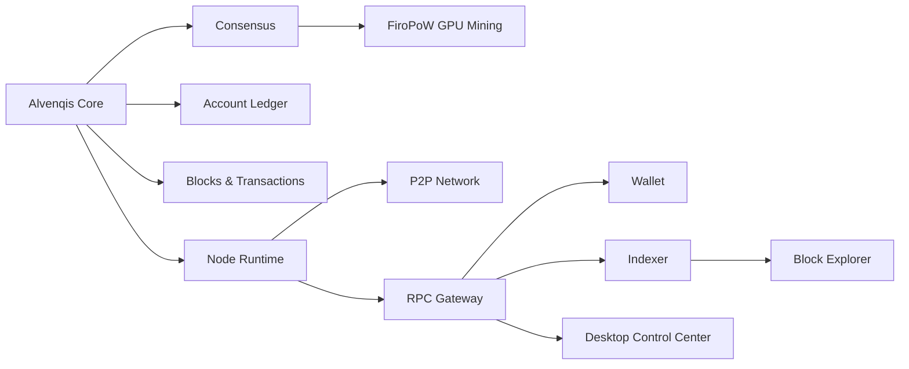

<!--
  GitHub Profile README
  Repository: https://github.com/andreidohot/andreidohot
-->

<p align="center">
  
</p>

<p align="center">
  <a href="https://github.com/andreidohot/Alvenqis-Network-Main">
    
  </a>
  
  
</p>

<p align="center">
  
</p>

<p align="center">
  <a href="https://github.com/andreidohot">
    
  </a>
  <a href="https://github.com/andreidohot/Alvenqis-Network-Main">
    
  </a>
  
</p>

---

## `01.` Identity

I am **Andrei Dohot**, a blockchain, Android and iOS developer focused on building complete digital products, distributed infrastructure and independent protocol systems.

I am the **Founder, Creator and Lead Architect of [Alvenqis Network](https://github.com/andreidohot/Alvenqis-Network-Main)** — an independent **Layer 1 blockchain** developed from its own Rust-based protocol implementation.

Alvenqis is not an ERC-20 token, a Solana token or a blockchain-branded centralized database. It is being engineered as a complete ecosystem with its own blockchain core, consensus rules, node runtime, peer-to-peer networking, wallet infrastructure, GPU mining software, RPC services, indexer, explorer and desktop control tooling.

```text
BUILD THE PROTOCOL.
VERIFY THE STATE.
OWN THE INFRASTRUCTURE.
```

---

## `02.` Featured Project — Alvenqis Network

<p align="center">
  <a href="https://github.com/andreidohot/Alvenqis-Network-Main">
    
  </a>
</p>

> **Project status:** Mainnet Candidate / Experimental Prototype
> Alvenqis Network is under active development and is not currently presented as a public production blockchain.

| Network property               | Current direction                          |
| :----------------------------- | :----------------------------------------- |
| **Project**                    | Alvenqis Network                           |
| **My role**                    | Founder, Creator & Lead Architect          |
| **Blockchain type**            | Independent Layer 1                        |
| **Core implementation**        | Rust                                       |
| **Ledger model**               | Account-based                              |
| **Consensus**                  | Proof of Work                              |
| **Mining algorithm**           | FiroPoW 0.9.4                              |
| **Official mining direction**  | NVIDIA GPU / CUDA                          |
| **Native asset**               | ALVE                                       |
| **Target block time**          | 60 seconds                                 |
| **Maximum theoretical supply** | 60,000,000 ALVE                            |
| **Halving interval**           | 1,576,800 blocks — approximately 3 years   |
| **Current classification**     | Mainnet Candidate / Experimental Prototype |

### Core ecosystem



The current ecosystem direction includes:

* Native Rust blockchain core
* Account ledger, transactions and digital signatures
* Proof-of-Work consensus and difficulty logic
* FiroPoW validation and NVIDIA CUDA mining
* Mempool, fork choice and chain reorganization handling
* Runnable node and peer-to-peer networking prototype
* RPC gateway, wallet CLI and desktop wallet tooling
* Indexer and block explorer
* Mining pool research and controlled testing
* Future digital assets, NFTs, identity proofs and application infrastructure

### On-chain / off-chain model

Alvenqis is designed to keep **ownership, state, hashes, permissions and verifiable proofs on-chain**, while large or private content remains off-chain.

```text
ON-CHAIN
balances · ownership · state · hashes · proofs · permissions

OFF-CHAIN
media · files · encrypted messages · application data · large metadata
```

This architecture is intended to preserve verifiability without forcing every node to permanently replicate large files or private application content.

> **Experimental asset notice:** ALVE balances and mining rewards produced by the current development network are protocol-testing values. They do not represent legal tender, guaranteed value, an investment product or production-ready cryptocurrency funds.

---

## `03.` What I Build

### Blockchain & distributed systems

* Layer 1 blockchain architecture
* Consensus and protocol rules
* Proof-of-Work systems
* GPU mining and CUDA integration
* Nodes and peer-to-peer networking
* Wallet architecture and transaction signing
* RPC gateways and developer APIs
* Indexers and block explorers
* Digital ownership and proof systems
* Blockchain security research

### Android & iOS

* Native Android applications with Kotlin
* Native iOS applications with Swift
* Cross-platform product architecture
* Authentication and account systems
* Secure local storage and synchronization
* Payments, subscriptions and application monetization
* Store-ready product planning
* Mobile-first UI and UX systems

### Full-stack products

* React, Vite and Tailwind applications
* Node.js backend services
* PostgreSQL data architecture
* REST APIs and integrations
* Admin dashboards and control panels
* Real-time application workflows
* Product design and scalable system architecture

### Infrastructure & DevOps

* Linux and VPS administration
* Docker and Docker Compose
* Reverse proxies and Cloudflare
* Deployment automation
* Monitoring and operational tooling
* GitHub and self-hosted Git workflows
* Storage, databases and service architecture
* Security-oriented infrastructure design

---

## `04.` Technology Stack

### Protocol, systems and mobile

<p>
  
</p>

### Frontend and product interfaces

<p>
  
</p>

### Backend and data

<p>
  
</p>

### Infrastructure and workflow

<p>
  
</p>

---

## `05.` Current Engineering Focus

```rust
pub struct CurrentFocus {
    pub blockchain: &'static str,
    pub consensus: &'static str,
    pub mining: &'static str,
    pub mobile: &'static str,
    pub infrastructure: &'static str,
}

let focus = CurrentFocus {
    blockchain: "Alvenqis Network protocol reliability",
    consensus: "Proof-of-Work validation and chain security",
    mining: "FiroPoW and NVIDIA CUDA tooling",
    mobile: "Production-grade Android and iOS applications",
    infrastructure: "Self-hosted, observable and scalable systems",
};
```

My current priorities are:

* Strengthening Alvenqis consensus and validation rules
* Improving node synchronization and P2P reliability
* Expanding wallet security and recovery architecture
* Optimizing FiroPoW GPU mining workflows
* Developing explorer, indexer and RPC infrastructure
* Building mobile products for Android and iOS
* Creating reliable deployment and operational systems
* Keeping public project claims technically accurate and evidence-based

---

## `06.` Engineering Principles

| Principle                         | Meaning                                                   |
| :-------------------------------- | :-------------------------------------------------------- |
| **Code is the source of truth**   | Documentation must reflect the implementation             |
| **Security before visibility**    | Public launch comes after verification                    |
| **Build complete systems**        | Protocol, tooling and infrastructure must work together   |
| **Own critical infrastructure**   | Reduce unnecessary platform dependencies                  |
| **Separate proofs from payloads** | Store verifiable state on-chain and large data off-chain  |
| **Measure before claiming**       | Mainnet, performance and security claims require evidence |

---

## `07.` GitHub Analytics

<p align="center">
  
  
</p>

<p align="center">
  
</p>

<p align="center">
  
</p>

---

## `08.` Project Direction

<p align="center">
  
  
  
  
</p>

<p align="center">
  <strong>
    Building independent protocols, secure applications and infrastructure designed to survive beyond the prototype.
  </strong>
</p>

---

## `09.` Explore My Work

<p align="center">
  <a href="https://github.com/andreidohot/Alvenqis-Network-Main">
    
  </a>
  <a href="https://github.com/andreidohot?tab=repositories">
    
  </a>
</p>

<p align="center">
  
</p>
